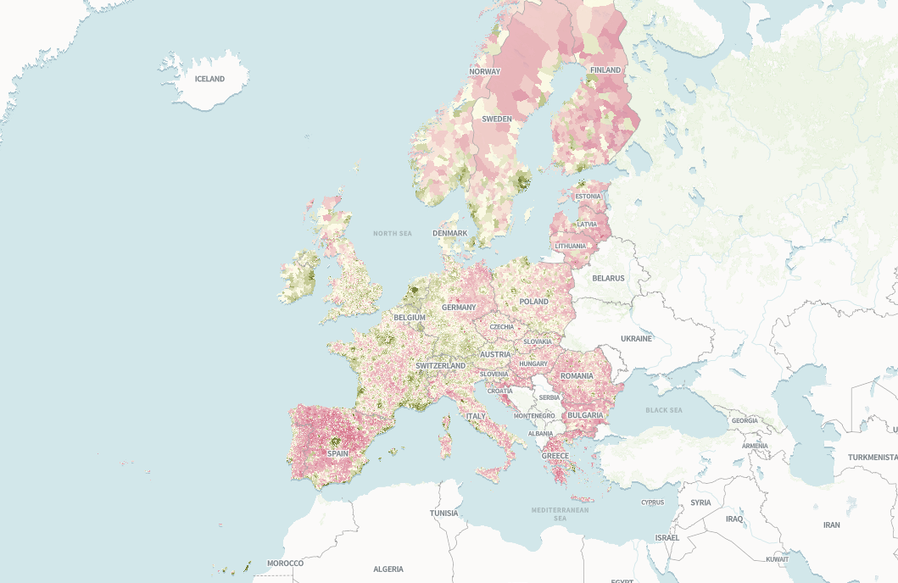

# Bienvenue à la vingt cinquième infolettre !

C’est le début du dernier fractionné avant l’été. Bienvenue à cette nouvelle infolettre.

# L’infographie

L’infographie du mois est démographique et européenne.

Correctiv a créé une **belle histoire visuelle qui explore les villes d’Europe** dont la population a décru ou augmenté depuis 1961.

L’histoire est double : une baisse de la population rurale vers les grandes villes et une baisse de la population dans les pays de l’est vers l’ouest.  
Allez scroller par [ici](https://correctiv.org/en/europe/2026/04/21/half-of-europes-towns-and-villages-have-fewer-residents-than-60-years-ago/) pour le détail et voir les résultats ville par ville.

Évolution de la population en Europe entre 1961 et 2024, [Correctiv](https://correctiv.org/en/europe/2026/04/21/half-of-europes-towns-and-villages-have-fewer-residents-than-60-years-ago/)

# Les prochains évènements du réseau

## Funathon sur le *machine learning* et l’IA - 📅 27 et 28 mai (en ligne)

L’Insee organise un **funathon** sur l’utilisation du *machine learning* et de l’IA dans le cadre du projet européen [ESS-Net AIML4OS](https://cros.ec.europa.eu/dashboard/aiml4os).

- **Dates** : 27 et 28 mai 2026 (100 % en ligne).
- **Public** : Ouvert aux agents du SSP (inscription par équipe de 5 personnes max).
- **Sujets proposés** (en anglais, connaissances minimales en Python et Git requises) :
  - Segmentation d’images satellites par *deep learning* ;
  - Codification automatique pour la classification NACE ;
  - Prévision des prix de l’immobilier sur données tabulaires par méthodes ensemblistes.
- **Objectifs pédagogiques** :
  - Utiliser l’IA et le *deep learning* pour produire des statistiques officielles ;
  - Une expérience pratique des outils de science des données (Git, Python) et des technologies cloud (GitHub, S3) ;
  - Trois projets d’apprentissage automatique et d’IA réutilisables et aboutis.
- **Inscription** : [Formulaire en ligne](https://grist.numerique.gouv.fr/o/docs/forms/kVB8TszNTEbuuPoquY8ze8/55). *⚠️ Places limitées : l’inscription est soumise à validation par l’organisateur.*
- **Plus d’infos** : [Site officiel du funathon](https://aiml4os.github.io/funathon-general-website/about.html).

## 📢 Journées Data Science & Open Source - 📅 16 et 17 juin (Paris)

L’Insee organise deux journées pour **démystifier la contribution à l’open source** et explorer des projets liés à la data science les 16 et 17 juin.

- **Lieu** : [Lieu de la Transformation Publique](https://cartes.gouv.fr/explorer-les-cartes?c=2.305609,48.847446&z=18&l=PLAN.IGN$GEOPORTAIL:GPP:TMS(1;1;1;0;standard)&w=&permalink=yes), Paris.
- **Format** : Présentiel uniquement (inscription **obligatoire** [ici](https://grist.numerique.gouv.fr/o/ssphub/forms/44ZC8RcBg3bjtvs5wy6wq5/55)).
- **Appel à projets** : Si vous avez un projet open source auquel vous souhaitez que les participants contribuent, [contactez-nous](mailto:ssphub-contact@insee.fr) !
- **Détails** : [Page de l’événement](../../talk/2026-06-jdos/index.llms.md).

# Actualités

## IA

### Des agents IA 🤖 dans la vraie vie

**L’adoption des agents IA** continue au sein de diverses structures, avec quelques déconvenues.

Aux États-Unis, le [New York Times](https://www.nytimes.com/2026/04/21/us/san-francisco-store-managed-ai-agent.html?unlocked_article_code=1.eFA.7jVB.5i5HUjjcUKyj&smid=url-share&utm_source=tldrai) s’est penché sur une expérimentation lancée par [Anton Labs](https://andonlabs.com/), une structure qui vise à “développer un monde robotisé sans humain”. Ils ont ainsi confié **la gestion d’une supérette à un agent** (utilisant Claude Sonnet 4.6) avec pour seul objectif de dégager un bénéfice. Il a ainsi recruté trois vendeurs, le vendeur étant payé 24\$ de l’heure et 22\$ de l’heure pour les deux vendeuses, il passe les commandes et fait l’inventaire (de manière approximative). Résultat, la supérette a un achalandage assez étrange, vend beaucoup de bougies et, pour le moment, est en déficit. **L’agent qui a un marché ne marche donc pas encore**.

Anton Labs a aussi simulé **une compétition entre trois agents IA pour gérer des distributeurs** et dont les résultats sont présentés sur [leur site](https://andonlabs.com/evals/vending-bench-arena). Rapidement, des agents ont adopté des comportements anti-concurrentiels et monopolistiques mais ils ont dégagé jusque 10 000\$ de profits (simulés).

### Risques et bonnes pratiques liés à l’usage d’agents ou d’IA

De nombreux posts relatent des **problèmes de sécurité liés à l’usage d’agent IA**. Selon les retours d’expérience, l’usage d’agents peut être utile mais nécessite la **mise en place de gardes-fous très stricts et de sauvegardes régulières non accessibles à des agents**, les agents pouvant contourner des prompts.

Le fondateur de [Datatalks](https://datatalks.club/) raconte ainsi dans [cet article](https://medium.com/@glasier067/claude-code-accidentally-deleted-a-production-database-heres-what-really-happened-9135b4bb2318) comment un agent IA a supprimé l’intégralité des bases de production de son site de formation lors de la migration entre deux serveurs.

Des chercheurs se sont intéressés par ailleurs à **l’impact de l’IA sur l’environnement et les mentalités**.

- L’IA réchaufferait ainsi l’égo et rendrait les gens moins sympathiques entre eux selon [cette étude de Nature](https://www.nature.com/articles/d41586-026-00979-x).
- Par ailleurs, les **data centers utilisés pour l’IA réchaufferaient localement la Terre de 2°C** selon [cette analyse](https://doi.org/10.48550/arXiv.2603.20897) menée notamment par des chercheurs de l’INRIA et de l’Institut d’ingénierie et de management de Grenoble. Ils estiment que 340 millions de personnes pourrait être concernés par ces îlots de chaleur.

## Open Source : plus ou moins ?

L’open source **a le vent en poupe en ce moment**, la souveraineté étant devenu un *buzz word* international. A ce titre, deux exemples différents de renouvellement de stratégies.

Bloomberg [a annoncé fin mars](https://www.bloomberg.com/company/stories/sustaining-opentelemetry-cncf-moving-from-dependency-management-to-stewardship/) **renforcer son soutien stratégique aux projets ouverts**. Leur nouvelle stratégie repose sur le constat que connaître ses dépendances n’est pas suffisant. L’open source vit en effet grâce aux communautés autour des projets: si la communauté meurt, le projet va tomber en déshérence puis mourir. Bloomberg a ainsi décidé de soutenir plus activement les projets ouverts dont il dépend: des employés de l’agence de presse sont maintenant payés pour soutenir des projets open source stratégiques.

A l’inverse, au Royaume-Uni, **le NHS a annoncé un (triste) revirement de sa stratégie open-source**, craignant que publier des codes ne mette à jour des vulnérabilités informatiques à l’heure d’agents IA. Ce revirement, après une stratégie d’ouverture, a énervé [Terence Eden, un développeur anglais](https://shkspr.mobi/blog/2026/05/nhs-goes-to-war-against-open-source/): l’open source fait plus partie de la solution que du problème.

## Outils et ressources

Ce mois-ci, une foison de nouveaux jouets technologiques à aller regarder.

### R, SQL et données

- **`ggalttext`** : Un package R pour générer automatiquement des **textes alternatifs** pour les graphiques `ggplot` ([leur repo GitHub](https://github.com/y-sunflower/ggalttext)).
- **a Grammar of graphics in SQL** : `ggsql` est une extension SQL inspirée de `ggplot`, développée par Posit et présentée sur leur [blog](https://opensource.posit.co/blog/2026-04-20_ggsql_alpha_release/).
- **Anonymisation de données** :
  - **OpenAI** : Outil de détection et masquage des données personnelles dans un texte ([lien](https://openai.com/index/introducing-openai-privacy-filter/)).
  - **Dalibo** : Solution pour anonymiser des bases PostgreSQL ([documentation](https://labs.dalibo.com/postgresql_anonymizer)).
- Vous cherchez une **alternative à Google Street View** (#souveraineté) ? Le français 🐓 [Panoramax](https://panoramax.fr) est fait pour vous et est open source.
- **Parsing de PDF** :
  - Comment choisir quel outil utiliser pour parser un pdf ? Des chercheurs de l’université de Offenburg et de Mannheim se sont penchés sur la question dans leur article [Benchmarking PDF Parsers on Table Extraction with LLM-based Semantic Evaluation](https://doi.org/10.48550/arXiv.2603.18652).
  - **OpenDataLoader PDF** : Parser open source pour les RAG, sans GPU ([site](https://opendataloader.org/)).

### Quarto 1.9 : Nouveautés

- La notion de marque (ou *brand*) permet **d’uniformiser le rendu d’un document à plusieurs formats** et de prendre en compte les thèmes clair/sombre des utilisateurs. Les dernières évolutions sont présentées dans ce [post par Mickaël Canouil](https://mickael.canouil.fr/posts/2026-04-15-quarto-brand-figures-tables/).
- Elle permet par ailleurs de générer des **pdf accessibles** ! Ce [post](https://quarto.org/docs/blog/posts/2026-03-05-pdf-accessibility-and-standards/) détaille ce qu’il faut faire.

### Fun et formation

- Pour écrire **votre nom sur la Terre,** rendez-vous sur le [site de la NASA](https://science.nasa.gov/specials/your-name-in-landsat).

Infolettre écrit en images satellites

- **Formation et cinéma**: deux chaines youtube pour se former au machine learning et concilier cinéma et formation.
  - une [première chaîne](https://youtube.com/playlist?list=PLQ9F4IqcaHKq-qVkrYhNPMQrU4TlyziAx&si=WLWCfIvokaOyEj3N) retraçant l’histoire du machine learning à travers des vidéos pédagogiques. Idéale pour comprendre l’évolution des algorithmes et des paradigmes depuis les débuts jusqu’aux LLM.
  - un [entretien](https://www.youtube.com/watch?v=GTZVN8nqSR4) avec Solomon Hykes, l’un des créateurs de Docker dans les années 2010.

# Appel à contributions

Vous avez un projet open source, une actualité ou une ressource à partager ? **Contactez-nous** pour les inclure dans la prochaine infolettre !
