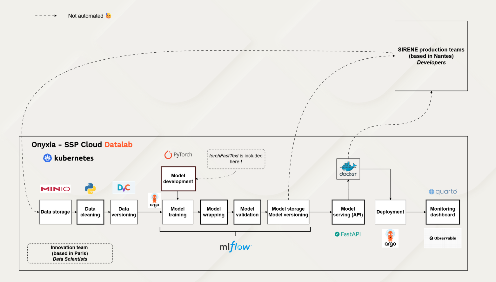
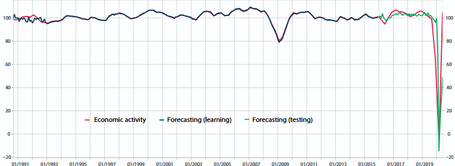
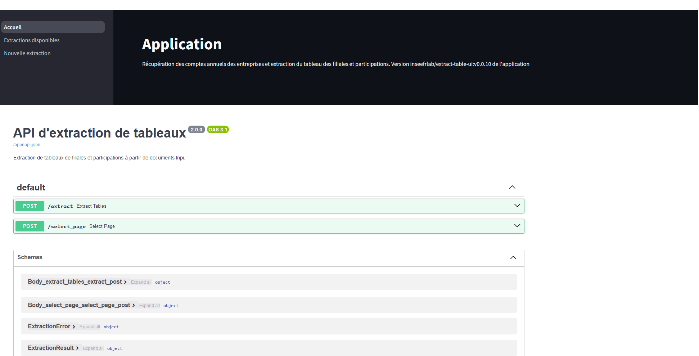

# Project summary

|  | Recoding NACE 2.0 to NACE 2.1 with LLMs |
|----|----|
| **Project details** | INSEE operates a production classifier - [TorchTextClassifiers](https://github.com/InseeFrLab/TorchTextClassifiers) - trained on 2.7 million observations labelled under the European economic activity nomenclature NACE 2.0. The revision of this nomenclature to version 2.1 requires **retraining the classifier on new labelled data**. An official correspondence table handles univocal codes (1-to-1 mapping between old and new NACE codes), but 52% of the training corpus involves “multivocal” codes - one old code corresponding to several new codes (typically 2 to 5, but more than 30 in some extreme cases) - representing approximately 1.4 million observations that cannot be manually relabelled. The project develops an **automated LLM-based re-labelling method** to solve this structural problem, which recurs at every nomenclature revision (NACE, COICOP, ISCO…). |
| **Stakeholders** | [INSEE](https://www.insee.fr/) |
| **Approach** | The method is called **RBAG** (*Rule-Based Augmented Generation*): rather than asking the LLM to generate a code freely from all 732 NACE 2.1 categories (which would produce hallucinations), it **selects from only the candidate codes** provided by the official correspondence table, enriched with the NACE 2.1 explanatory notes. The output is structured (JSON) and a **three-model open-source ensemble** (Qwen3-235B MoE, Qwen3-235B MoE with thinking mode, Gemma4-27B MoE) is used with majority voting. The full pipeline is orchestrated on [SSP Cloud](https://datalab.sspcloud.fr/) via Argo Workflows. |
| **Project results** | On a benchmark of ~30,000 observations annotated by ~25 NACE experts, the LLM ensemble achieves **78% accuracy**. The TorchTextClassifiers model retrained on the semi-synthetic corpus (~2.3 million labels) reaches **~80% accuracy on NACE 2.1**, matching the performance of the original NACE 2.0 classifier - validating the semi-synthetic training set approach. A comparison with a pure RAG approach (without the correspondence table) shows a ~10-point gap in favour of RBAG. |
| **Products and documentation** | Presentation at the [ISI Regional Statistics Conference 2026](https://www.isi-web.org/), Malta - [slides available online](https://jpramil.github.io/prez_recodif_isi/) |
| **Project code** | Repository available on [GitHub ](https://github.com/InseeFrLab/codif-ape-nace-revision) |

# Similar projects

##### GDP Tracker: a tool for continuous economic forecasting

Models of *machine learning* for real-time forecasting (*nowcasting*) to feed INSEE’s economic analyses

1 Jan 2022

##### Methodological work on the Family Budget survey

Modernisation of the family budget survey using automatic classification tools

1 Jan 2022

##### Jocas, webscraping online job offers

The project `Jocas` (Job offers collection and analysis system) project enables the DARES (Ministerial Statistical Office for Labour) to automatically collect job offers…

1 Jan 2022

##### Automatic coding of companies’ main activity

Develop a machine learning algorithm to automate the classification of companies’ main activities and put it into production

1 Jan 2022

##### Predicting growth by reading the newspaper

Use continuous press articles to build an indicator to help forecast growth

1 Mar 2021

##### Automatic extraction of the table of subsidiaries and holdings from company accounts

Extract information from company accounts tables, in particular tables of subsidiaries and holdings, contained in scanned images made available by INPI via an API

1 Jan 2021

##### Automatic coding of occupations in the PCS 2020 nomenclature

Automatically code occupations as part of the switch to the new PCS nomenclature (PCS 2020)

1 Jan 2021

##### Population movements around the March 2020 containment using mobile phone network operators data

INSEE has had access to mobile telephony data as part of the monitoring of the 2020 health crisis. These data were used to produce the following statistics on population…

1 Nov 2020

##### Classification of checkout data using machine learning

Using machine learning to classify scanner data in the COICOP nomenclature to calculate the CPI

1 Jan 2020

##### Automatic coding of association activity

Automatic coding of association activity using machine learning methods

1 Jun 2019

##### Detecting and processing outliers or missing values, application to the Déclaration Sociale Nominative (Social Nominative Declarations)

Use of machine learning methods to detect and process outliers or missing values, application to the Social Nominative Declarations (Déclaration Sociale Nominative)

1 Jan 2018
