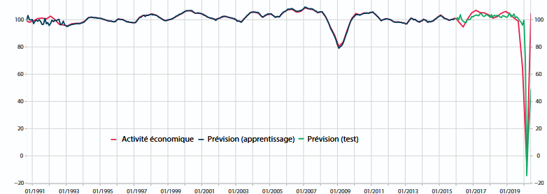

# Synthèse du projet

|  | Recodification de la NACE 2.0 vers la NACE 2.1 avec des LLMs |
|----|----|
| **Détail du projet** | L’Insee dispose d’un classifieur en production - [TorchTextClassifiers](https://github.com/InseeFrLab/TorchTextClassifiers) - entraîné sur 2,7 millions d’observations étiquetées selon la nomenclature européenne des activités économiques NACE 2.0. La révision de cette nomenclature vers la version 2.1 impose de **réentraîner ce classifieur sur de nouvelles données labellisées**. Une table de correspondance officielle permet de retraiter automatiquement les codes univoques (correspondance 1-à-1 entre les anciens codes et les nouveaux codes de la NACE), mais 52 % du corpus implique des codes « multivocaux » - un ancien code pouvant correspondre à plusieurs nouveaux codes (2 à 5 en général, mais plus de 30 dans certains cas extrêmes), ce qui représente environ 1,4 million d’observations impossibles à retraiter manuellement. Le projet développe une méthode de **réétiquetage automatique par LLM** pour résoudre ce problème structurel, récurrent lors de toute révision de nomenclature (NACE, COICOP, ISCO…). |
| **Acteurs** | [Insee](https://www.insee.fr/) |
| **Approche** | La méthode développée est appelée **RBAG** (*Rule-Based Augmented Generation*) : le LLM ne génère pas librement un code parmi les 732 catégories NACE 2.1 (ce qui produirait des hallucinations), mais **choisit parmi les seuls codes candidats** fournis par la table de correspondance officielle, enrichis des notes explicatives NACE 2.1. La réponse est structurée (JSON) et un **ensemble de trois modèles open-source** (Qwen3-235B MoE, Qwen3-235B MoE en mode *thinking*, Gemma4-27B MoE) est utilisé avec vote majoritaire. L’ensemble du pipeline est orchestré sur le [SSP Cloud](https://datalab.sspcloud.fr/) via Argo Workflows. |
| **Résultats du projet** | Sur un benchmark de ~30 000 observations annotées par ~25 experts NACE, l’ensemble de LLMs atteint **78 % de précision**. Le classifieur TorchTextClassifiers réentraîné sur le corpus semi-synthétique (~2,3 millions de labellisations) atteint **~80 % de précision sur NACE 2.1**, soit des performances équivalentes à celles du classifieur NACE 2.0, validant l’approche par train-set semi-synthétique. Une comparaison avec une approche RAG pure (sans table de correspondance) montre un écart de ~10 points en défaveur du RAG. |
| **Produits et documentation du projet** | Présentation à l’[ISI Regional Statistics Conference 2026](https://www.isi-web.org/), Malte - [slides disponibles en ligne](https://jpramil.github.io/prez_recodif_isi/) |
| **Code du projet** | Dépôt disponible sur [GitHub ](https://github.com/InseeFrLab/codif-ape-nace-revision) |

# Projets similaires

##### Travaux méthodologiques sur l’enquête Budget de Famille

Modernisation de l’enquête budget des familles par utilisation d’outils de classification automatique

1 janv. 2022

##### Jocas, webscraping des offres d’emploi en ligne

Le projet `Jocas` (Job offers collection and analysis system) permet à la DARES (Service statistique ministériel Travail) de collecter automatique des offres d’emploi en…

1 janv. 2022

##### Codification automatique de l’activité principale des entreprises

Développer un algorithme de machine learning pour automatiser la classification de l’activité principale des entreprises et mise en production

1 janv. 2022

##### Prévoir la croissance en lisant le journal

Utiliser les articles de presse en continu pour construire un indicateur aidant à prévoir la croissance

1 mars 2021

##### Extraction automatique du tableau des filiales et participations des comptes sociaux des entreprises

Extraire les informations de tableaux de comptes sociaux, en particulier des tableaux des filiales et participations, contenus dans des images scannées mises à disposition…

1 janv. 2021

##### Codification automatique des professions dans la nomenclature PCS 2020

Codifier automatiquement les professions dans le cadre de la bascule vers la nouvelle nomenclature PCS (PCS 2020)

1 janv. 2021

##### Mouvements de population autour du confinement de mars 2020 grâce aux données de téléphonie mobile

L’Insee a eu accès à des données de téléphonie mobile dans le cadre du suivi de la crise sanitaire de 2020. Ces données ont permis de produire les statistiques sur les…

1 nov. 2020

##### Classification des données de caisse à partir de machine learning

Classifier des données de caisse dans la nomenclature COICOP par machine learning pour le calcul de l’IPC

1 janv. 2020

##### « GDP Tracker » : un outil pour des prévisions économiques en continu

Modèles de *machine learning* pour effectuer des prévisions en temps réel (*nowcasting*) pour alimenter les analyses conjoncturelles de l’Insee

1 déc. 2019

##### Codification automatique de l’activité des associations

Codification automatique de l’activité des associations à partir de méthodes de machine learning

1 juin 2019

##### Détecter et traiter les valeurs aberrantes ou manquantes, application à la Déclaration Sociale Nominative

Utilisation des méthodes de machine learning pour la détection et le traitement des valeurs aberrantes ou manquantes, application à la Déclaration Sociale Nominative

1 janv. 2018
